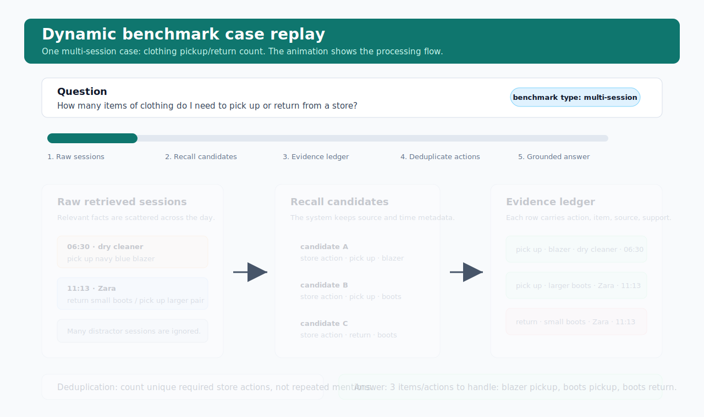

<div align="center">

<table>
  <tr>
    <td valign="middle">
      <h1>Holographic Memory System</h1>
    </td>
    <td width="112" align="center" valign="middle">
      
    </td>
  </tr>
</table>

**HMS · Structured Memory Intelligence**

*Evidence-grounded memory for reliable long-horizon reasoning*

**ShadowWeave Team**

<a href="https://arxiv.org/"></a>


[English](README.md) · [中文](README.zh-CN.md)

</div>

<p align="center">
  
</p>

---

## Abstract

The **Holographic Memory System (HMS)** is a reproducible long-term memory QA
framework for studying whether structured answer-time evidence organization can
improve a language model's reasoning over retrieved memories.

The project focuses on the LongMemEval setting, where a question may require
evidence from multiple sessions, timestamps, extracted memory facts, and raw
source snippets.

## Experiment Design

The experiment separates memory QA into four stages:

```text
Question
  -> retrieve existing memories
  -> organize retrieved evidence
  -> generate a grounded answer
  -> evaluate the answer
```

The core idea is to avoid giving the answer model a loose list of retrieved
facts. Instead, the system builds an intermediate evidence structure that makes
time, source, event state, and numeric signals explicit before generation.

This setup is useful for studying questions such as:

- whether the model can connect evidence across sessions
- whether the model can distinguish old and current user states
- whether the model can ground relative dates to concrete memories
- whether the model can avoid duplicate counting
- whether missing numeric sides are handled conservatively

## Visual Demo

The project includes a database-free demo for external readers. It shows how
raw retrieved sessions are converted into an organized evidence ledger before
answer generation.


Open the standalone demo page:

```text
docs/memory_pipeline_demo.html
```

This page can be viewed directly in a browser and does not require model keys,
database access, or benchmark artifacts.

## Dynamic Case Replay

The repository also includes a concrete benchmark-style case replay. It shows a
single multi-session question and animates how scattered session snippets move
through retrieval, evidence ledger construction, deduplication, and grounded
answer generation.



Open the auto-playing replay page:

```text
docs/benchmark_case_replay.html
```

The replay page auto-advances through the raw session snippets, recall candidates,
ledger rows, duplicate-control rule, answer packet, and final grounded response
for the same case.

## Pipelines

Two pipeline modes are exposed through the benchmark script.

### Ledger Pipeline

The ledger pipeline keeps memory retrieval unchanged and adds a structured
evidence ledger before answer generation.

For high-risk question types, the ledger records:

- event time
- mention time
- source session or document
- fact type
- compact evidence text
- numeric, date, and update signals
- raw source snippets for grounding

Use this mode when you want to reproduce the main evidence-organization
experiment.

### Self-Evolution Pipeline

The self-evolution pipeline keeps the ledger pipeline and adds a lightweight
answer-time controller. The controller is driven by diagnosed failure patterns:

- count and total deduplication
- relative-date lookup grounding
- amount and difference calibration
- current versus previous state arbitration

This mode is intended for studying whether targeted control instructions can
improve or change memory reasoning behavior after retrieval.

## Repository Layout

```text
.
├── .aaaSCRIPT/
│   └── run_benchmark.sh
├── core/
│   ├── dataplane/
│   ├── daemon/
│   └── local-suite/
├── deploy/
├── docs/
│   ├── assets/
│   │   ├── branding/
│   │   │   ├── hms-banner.png
│   │   │   └── shadowweave_v6.png
│   │   ├── benchmark_case_replay.svg
│   │   └── memory_pipeline_demo.svg
│   ├── benchmark_case_replay.html
│   └── memory_pipeline_demo.html
├── interface/
├── lab/
│   └── evaluation/
│       └── benchmarks/
│           ├── common/
│           │   └── benchmark_runner.py
│           └── longmemeval/
│               └── longmemeval_benchmark.py
├── tooling/
├── .env.example
├── README.md
└── README.zh-CN.md
```

Important files:

- `.aaaSCRIPT/run_benchmark.sh`: unified experiment script
- `docs/assets/branding/hms-banner.png`: project identity banner
- `docs/assets/branding/shadowweave_v6.png`: ShadowWeave team identity artwork
- `docs/benchmark_case_replay.html`: auto-playing single-case process replay
- `docs/assets/benchmark_case_replay.svg`: README-embedded animated case replay
- `docs/memory_pipeline_demo.html`: static before/after visualization
- `docs/assets/memory_pipeline_demo.svg`: README-embedded visual summary
- `lab/evaluation/benchmarks/longmemeval/longmemeval_benchmark.py`: LongMemEval pipeline implementation
- `lab/evaluation/benchmarks/common/benchmark_runner.py`: shared evaluation runner
- `.env.example`: local configuration template

## Environment Setup

Create a local environment file:

```bash
cp .env.example .env
```

Then fill in your own database and model-provider settings.

The framework loads configuration from `.env`. Do not hard-code credentials in
the source code.

## Reproduction Logic

The benchmark script defaults to retrieval-only mode:

```text
HMS_RETRIEVAL_ONLY=1
```

In this mode, memory extraction and ingestion are skipped. The experiment uses
memory units already stored in the configured database. This keeps retrieval
and answer-time evidence organization experiments consistent and fast.

The expected reproduction flow is:

```text
1. Prepare database and model configuration in .env
2. Ensure the memory database already contains the required memory units
3. Select a pipeline mode
4. Run the LongMemEval script
5. Inspect generated local artifacts under ignored runtime directories
```

## Run the Ledger Pipeline

```bash
export HMS_RETRIEVAL_ONLY=1
export HMS_PIPELINE=ledger
export HMS_MAX_INSTANCES=500
export HMS_SESSION_EXPANSION_WEIGHT=0.5

bash .aaaSCRIPT/run_benchmark.sh \
  --parallel 8 \
  --max-concurrent-questions 8 \
  --eval-semaphore-size 8 \
  --quiet
```

## Run the Self-Evolution Pipeline

```bash
export HMS_RETRIEVAL_ONLY=1
export HMS_PIPELINE=self_evolution
export HMS_MAX_INSTANCES=500
export HMS_SESSION_EXPANSION_WEIGHT=0.5

bash .aaaSCRIPT/run_benchmark.sh \
  --parallel 8 \
  --max-concurrent-questions 8 \
  --eval-semaphore-size 8 \
  --quiet
```

## Common Runtime Options

Useful environment variables:

- `HMS_PIPELINE`: `ledger` or `self_evolution`
- `HMS_RETRIEVAL_ONLY`: set to `1` to skip ingestion and reuse existing memories
- `HMS_MAX_INSTANCES`: limit the number of evaluated questions
- `HMS_MAX_QUESTIONS`: limit questions after filtering
- `HMS_DATASET_PATH`: provide a local LongMemEval dataset path
- `HMS_SESSION_EXPANSION_WEIGHT`: override session expansion weight
- `HMS_PYTHON_BIN`: use a specific Python interpreter

Useful command-line options:

- `--parallel`: number of instances processed concurrently
- `--max-concurrent-questions`: maximum concurrent question-level tasks
- `--eval-semaphore-size`: evaluator concurrency limit
- `--category`: run a specific LongMemEval category
- `--question-id`: run one or more question IDs
- `--skip-ingestion`: skip ingestion and use existing database memories
- `--quiet`: reduce console output

## Runtime Artifacts

When the experiment runs, local runtime artifacts are written under ignored
directories:

```text
.aaaLOG/
.aaaRESULT/
```

These directories are for local reproduction and should not be committed.
